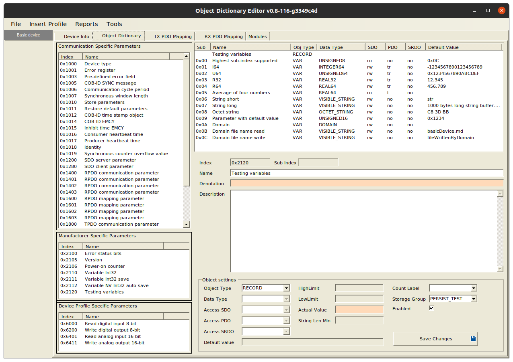

CANopen basicDevice Example
===========================

Example of basic CANopen device, with quite rich functionality. It is based on [CANopenNode](https://github.com/CANopenNode/CANopenNode), which is free and open source CANopen Stack, based on ([CiA301](http://can-cia.org/standardization/technical-documents)) standard.

Example contains object dictionary with most common communication parameters and some additional manufacturer specific and device profile parameters. See picture below or complete OD documentation in [basicDevice.md](basicDevice.md). Note also project file `basicDevice.xdd`, which can be opened and edited with EDSEditor.exe (Linux or Windows application). EDSEditor can export other files, including OD.h and OD.c source files for this example. `basicDevice.xdd` and `basicDevice.eds` are standard CANopen device description files and can be opened also with other CANopen tools.

Example program
---------------

### Makefile
It includes most common CANopen files and options for compilation.

It also generates `CO_version.h` file with information about git version number of CANopenNode and CANopenSocket, for example:

    #define CO_VERSION_CANOPENNODE "v4.0-12-g09bf926-dirty"
    #define CO_VERSION_APPLICATION "v1.2-20-g94add15-dirty"

This information is available from OD entry 0x2105, 01:

    ./cocomm "4 r 0x2105 1 vs"
    [1] "v4.0-12-g09bf926-dirty"

"v4.0" is latest tag name, "12" is number of commits above the tag, "g" is git, "09bf926" is commit number and optional "dirty" means, git repository has uncommited changes.

Makefile also defines macro `CO_DRIVER_CUSTOM`, which includes `CO_driver_custom.h` into the foundation of all source files.

#### CANopenNode program flow

CANopenNode driver for Linux is written in a way, that program execution is triggered by different events, like reception of CAN message, one of the many timers expiration, other file descriptor based events, etc. All CANopenNode functions are non-blocking. After event occurs, all mainline and/or realtime functions are processed. In simpler, microcontroller based applications, mainline functions are executing in infinite loop and realtime functions are executed precisely each timer interval, 1ms typically.

CANopenNode driver for Linux offers two options, configurable with makefile:
1. Whole program runs in single thread. This is default for `canopend`. This uses less system resources.
2. Mainline functions are executing in primary thread and realtime functions are executed in own thread, triggered by precise timer. This way it is easier to achieve realtime operation and may be easier to implement a controller with access to peripherals, like digital input/output pins. This is default for `basicDevice`.

### CO_application.h and CO_application.c

Those files contains five functions, which are called from `main()` function inside `CANopenNode/socketCAN/CO_main_basic.c` file. They are central part of our `basicDevice` application program:

    CO_ReturnError_t app_programStart(bool_t CANopenConfigured, uint16_t *errinfo);
    void app_communicationReset(bool_t CANopenConfigured);
    void app_programEnd();
    void app_programAsync(bool_t CANopenConfigured, uint32_t timer1usDiff);
    void app_program1ms(bool_t CANopenConfigured, uint32_t timer1usDiff);

### testingVariables.h and testingVariables.c

Those files contains example usage of OD entry "Testing variables" with multiple different sub entries.

Entry has IO extension enabled. This means that some entries are accessed with custom read/write functions. See source files and examples below for details.

Testing with Linux
------------------

You should successfully finish `CANopenNode/doc/gettingStarted.md`, before continuing with this example. Here more advanced and more usable command line application, `cocomm`, will be used.

### Some background about communication paths, when using cocomm

`cocomm` is a small command line program, which establishes socket connection with `canopend`. It sends standardized CANopen commands (CiA309-3) to gateway and prints the responses to stdout and stderr.

1. `canopend` serves a socket connection on `/tmp/CO_command_socket` address. This is local Unix socket, TCP socket can be used also. `canopend` is pure CANopen device with commander functionalities and gateway. It listens for socket connections.
2. When run, `cocomm` tries to connect to `/tmp/CO_command_socket` address (this is default setting). `canopend` accepts the connection.
3. `cocomm` writes the specified ascii command to established socket connection, for example `[1] 4 read 0x1017 0 u16`.
4. Gateway in `canopend` receives the command and decodes it. `read` commands goes internally into `CO_SDOclientUploadInitiate()` and then command is processed with multiple `CO_SDOclientUpload()` function calls.
5. `CO_SDOclientUpload()` now sends a CAN message to our `basicDevice`. (CAN interface in Linux is implemented with CAN sockets. This is the third type of sockets mentioned here.) However, in our example `basicDevice` receives SDO request, asking the value of the variable, located in Object Dictionary at index 0x1017, subindex 0.
6. Our `basicDevice` receives CAN message with CAN ID=0x604. It determines SDO request, so `CO_SDOserver_process()` function gets the message. Function gets the value from internal Object Dictionary and sends the CAN response with CAN ID=0x584. Those messages can be seen in candump terminal. And it is not necessary to understand the details of SDO communication, it may be quite complex.
7. `canopend` receives the CAN message, `CO_SDOclientUpload()` decodes it and sends binary value to gateway.
8. Gateway in `canopend` translates binary value to asciiValue, unsigned16 in our example. It prepares the response, in our case `[1] ` + asciiValue + `\r\n`. Then writes the response text back to `/tmp/CO_command_socket`.
9. `cocomm` reads the response text from local socket and prints it partly to stderr (`[1] \r\n`) and partly to stdout (asciiValue).
10. If there are more commands, step 3 is repeated. Otherwise `cocomm` closes the socket connection and exits.

### Testing variables

#### Prepare the environment
We will use four Linux terminals:

    # First terminal: candump
    sudo modprobe vcan
    sudo ip link add dev vcan0 type vcan
    sudo ip link set up vcan0
    candump -td -a vcan0

    # second terminal: basicDevice
    cd examples/basicDevice
    make
    ./basicDevice -i4 vcan0

    # third terminal: canopend (gateway)
    cd CANopenNode
    make
    ./canopend vcan0 -i1 -c "local-/tmp/CO_command_socket"

    # fourth terminal: cocomm (connection with gateway)
    cd cocomm
    make

#### basic cocomm usage
It is very similar as in `CANopenNode/doc/gettingStarted.md`, but actually easier.

    ./cocomm --help
    ./cocomm "help"
    ./cocomm "help datatype"
    ./cocomm "4 r 0x1017 0 u16"
    ./cocomm "1 r 0x1017 0 u16" "4 r 0x1017 0 u16"

`cocomm` program can be copied to standard location of executables, so we can run it from any directory, without leading `./`:

    sudo cp cocomm /usr/bin/cocomm

Parameters to program can be set by program arguments, as described in `cocomm --help`, and can also be changed by environmental variables. For example, to change default socket path in for all next `cocomm` commands in current terminal, type:

    export cocomm_socket=/tmp/CO_command_socket_test

Commands can be also written into a file, for example create a `commands.txt` file, and for its content enter the commands:

    [1] 1 start
    [2] 4 start

Then make `cocomm` use that file:

    $ cocomm -f commands.txt
    [1] OK
    [2] OK

#### Advanced variables and strings
Type commands and see responses in `cocomm` terminal. Optionally watch CAN communication in `candump` terminal.

    ./cocomm "4 r 0x2120 1 i64" "4 r 0x2120 2 x64" "4 r 0x2120 2 u64" "4 r 0x2120 2"
    [1] -1234567890123456789
    [2] 0x1234567890ABCDEF
    [3] 1311768467294899695
    [4] EF CD AB 90 78 56 34 12

    ./cocomm "4 r 0x2120 3 r32" "4 r 0x2120 4 r64"
    [1] 12.345
    [2] 456.789

    ./cocomm "4 r 0x2120 5 r64 # Custom read function calculates the average."
    [1] 1.93001e+16

    ./cocomm "4 w 0x2120 3 r32 -7.720058e+16" "4 r 0x2120 5 r64"
    [1] OK
    [2] 7.8681e+07

    ./cocomm "4 w 0x2120 6 vs 12" "4 r 0x2120 6 vs" \
             "4 w 0x2120 6 vs 1234" "4 r 0x2120 6 vs" \
             "4 w 0x2120 6 vs \"1 2\"" "4 r 0x2120 6 vs"
    [1] OK
    [2] "12"
    [3] ERROR:0x06070012 #Data type does not match, length of service parameter too high.
    [4] "12"
    [5] OK
    [6] "1 2"

    ./cocomm "4 r 0x2120 7 vs"
    [1] "1000 bytes long string buffer. Visible string may contain UTF-8 characters, like this 3 bytes long '€' Euro symbol. It may contain also control characters like tabs '	' or newLines '
    '."

    ./cocomm "4 w 0x2120 7 vs \"Writing newLines is not possible as visible string, but exotic \"\"ß\"\" characters works.\""
    [1] OK

    ./cocomm "4 r 0x2120 7 os" | base64 -d
    [1]
    Writing newLines is not possible as visible string, but exotic "ß" characters works.

    echo -ne "We can encode anything to base64\n\nand transfer data as octet string or domain." | base64 -w0 | ./cocomm -i "4 w 0x2120 7 os"
    [1] OK

    ./cocomm "4 r 0x2120 8 hex" "4 r 0x2120 8 os" "4 r 0x2120 8 vs" "4 r 0x2120 8 d" "4 r 0x2120 8"
    [1] C8 3D BB 00 00 00 00 00 00 00
    [2] yD27AAAAAAAAAA==
    [3] "�=�"
    [4] yD27AAAAAAAAAA==
    [5] C8 3D BB 00 00 00 00 00 00 00

    ./cocomm "4 w 0x2120 8 hex 01 02 03"
    [1] ERROR:0x06070013 #Data type does not match, length of service parameter too short.

    ./cocomm "4 w 0x2120 8 hex 01 2 30 456789 0A b0 0 ff"
    [1] OK

#### Parameter with default value

Value is read from Object Dictionary on program initialization and stored to internal variable. Each SDO read will read this internal variable, incremented by 1, but value in OD location will stay unchanged. SDO write will write to internal variable and to OD location. And subsequent SDO write to index 0x1010 (store parameters) will update the default value, valid at startup. Experiment with `cocomm` and see `testingVariables.c` file for implementation of this behaviour.

#### Domain
Domain enables transfer an arbitrary large block of data in one SDO communication cycle. In our example size is limited only by free space of file system, if we have a 64-bit computer. RAM usage is low. SDO block transfer is used for highest efficiency over CAN. In our example internal virtual CAN network is used, which is very fast. On real CAN networks data transfer rates are significantly lower. However, SDO communication does not disturb higher priority real time data transfer, which is likely present on CAN bus. SDO block transfer is also resistant to disturbances to some degree. If necessary, it re-transmits corrupted data.

See `testingVariables.c` file for implementation of large data transfer. Our `basicDevice` reads data from file, referenced by Object 0x2120, sub index 11. This is a text file in the same directory as our `basicDevice`. We can safely read the file as visible string. If necessary, transfer can be interrupted by `Ctrl+C`. SDO communication will be closed correctly by abort message.

    /cocomm "set sdo_block 1"
    [1] OK

    ./cocomm "4 r 0x2120 11 vs"
    [1] "basicDevice.md"

    ./cocomm "4 r 0x2120 10 vs"
    [1] "CANopen documentation
    =====================
    **Basic device**
    ....

Above works, but is not very practical. This is better:

    ./cocomm "4 r 0x2120 10 d" | base64 -d | pv > file1
    [1]
    ...success
    56,7KiB 0:00:00 [ 600KiB/s] [<=>                                      ]

    cmp file1 ../examples/basicDevice/basicDevice.md
    rm file1

If there is no response from `cmp` command, files are identical. `pv` is nice Linux command, which displays progress. Object 0x2120, sub index 11 can be changed to point to any other accessible file.

When we send data to our `basicDevice`, it stores them to file, referenced by Object 0x2120, sub index 12.

    ./cocomm "4 r 0x2120 12 vs"
    [1] "fileWrittenByDomain"

    pv cocomm.c | base64 -w0 | ./cocomm -i "4 w 0x2120 10 d"
    18,2KiB 0:00:00 [ 323MiB/s] [========================================>] 100%
    [1] OK

    cmp cocomm.c ../examples/basicDevice/fileWrittenByDomain

It is time to transfer something larger, like 100Mb random binary file:

    openssl rand 100000000 > binaryFile
    pv binaryFile | base64 -w0 | ./cocomm -i "4 w 0x2120 10 d"
    95,4MiB 0:01:02 [1,52MiB/s] [========================================>] 100%
    [1] OK

    cmp binaryFile ../examples/basicDevice/fileWrittenByDomain
    rm binaryFile ../examples/basicDevice/fileWrittenByDomain

Here is experimental candump output with two independent pairs of `canopend-basicDevice` communicating over one virtual CAN interface (two SDO block transfers interlaced):

    (000.000003)  vcan0  604   [8]  6F C3 A9 6E AF 5C 81 32   'o..n.\.2'
    (000.000010)  vcan0  604   [8]  70 B7 32 8A B2 B0 62 27   'p.2...b''
    (000.000006)  vcan0  604   [8]  71 4F 5F 0B F0 40 0B 53   'qO_..@.S'
    (000.000003)  vcan0  604   [8]  72 CE B9 49 D2 80 BD 55   'r..I...U'
    (000.000010)  vcan0  603   [8]  A2 7F 7F 00 00 00 00 00   '........' < response
    (000.000002)  vcan0  604   [8]  73 94 A2 9E E2 23 8C 5A   's....#.Z'
    (000.000005)  vcan0  604   [8]  74 13 90 A2 59 C3 9B 1D   't...Y...'
    (000.000003)  vcan0  604   [8]  75 5A F4 85 3A 3E B9 10   'uZ..:>..'
    (000.000011)  vcan0  604   [8]  76 30 81 CC 7D 2E 7E 0F   'v0..}.~.'
    (000.000000)  vcan0  583   [8]  01 FC 80 1C D4 8F 67 A2   '......g.'
    (000.000006)  vcan0  604   [8]  77 9B FA 36 21 0F 09 2E   'w..6!...'
    (000.000003)  vcan0  604   [8]  78 C2 6F 97 DC 1D 97 9E   'x.o.....'
    (000.000001)  vcan0  583   [8]  02 E0 B9 97 47 8D 37 E6   '....G.7.'
    (000.000008)  vcan0  583   [8]  03 07 B6 88 68 0B 6A 8C   '....h.j.'
    (000.000002)  vcan0  604   [8]  79 4E 6B 8D 2B 02 F5 9E   'yNk.+...'
    (000.000005)  vcan0  583   [8]  04 AD AC A3 B5 59 4C 30   '.....YL0'
    (000.000001)  vcan0  604   [8]  7A 23 97 5B D6 2A 02 F4   'z#.[.*..'
    (000.000007)  vcan0  583   [8]  05 67 6F 4C 1E AF 18 F3   '.goL....'
    (000.000007)  vcan0  604   [8]  7C 6E 6A 12 FE 5E 0B 5B   '|nj..^.['
    (000.000001)  vcan0  583   [8]  06 E0 43 D4 2E D2 98 BA   '..C.....'
    (000.000005)  vcan0  604   [8]  7D 4B BF 69 25 43 98 FF   '}K.i%C..'
    (000.000010)  vcan0  583   [8]  08 52 16 57 0D 11 72 AE   '.R.W..r.'
    (000.000001)  vcan0  604   [8]  7F 63 0C B1 2B 19 72 89   '.c..+.r.'
    (000.000007)  vcan0  583   [8]  09 67 3D EF B9 C1 32 D3   '.g=...2.'
    (000.000012)  vcan0  583   [8]  0A 3D 22 7E 79 5B D5 D4   '.="~y[..'
    (000.000010)  vcan0  584   [8]  A2 7F 7F 00 00 00 00 00   '........' < response
    (000.000001)  vcan0  583   [8]  0B EC 91 5C FF 04 0A D7   '...\....'
    (000.000011)  vcan0  583   [8]  0C 25 86 30 DC 44 6B 59   '.%.0.DkY'
    (000.000006)  vcan0  583   [8]  0D 56 8F B0 23 81 41 FF   '.V..#.A.'
    (000.000000)  vcan0  604   [8]  01 EF 91 CC EE E8 0D 9C   '........'
    (000.000006)  vcan0  604   [8]  02 EA EB 00 A8 34 71 3F   '.....4q?'
    (000.000002)  vcan0  583   [8]  0E 03 79 87 32 C6 96 15   '..y.2...'
    (000.000006)  vcan0  604   [8]  03 C2 A9 61 8E 25 3D 0A   '...a.%=.'
    ...
    (000.000003)  vcan0  604   [8]  79 16 F1 A6 12 9D 3D B2   'y.....=.'
    (000.000005)  vcan0  604   [8]  7A E2 75 5A 16 18 66 37   'z.uZ..f7'
    (000.000003)  vcan0  583   [8]  6B 72 30 0A 0F C2 2C F9   'kr0...,.'
    (000.000000)  vcan0  604   [8]  7B 82 AE B2 D8 F0 71 32   '{.....q2'
    (000.000010)  vcan0  604   [8]  7C 2A 04 DD BE 30 A4 6E   '|*...0.n'
    (000.000001)  vcan0  583   [8]  6C EA 98 F4 F2 DA C6 93   'l.......'
    (000.000005)  vcan0  604   [8]  7D 68 15 72 4D D0 B5 48   '}h.rM..H'
    (000.000005)  vcan0  583   [8]  6D 7B 24 4D 6E 6A C0 71   'm{$Mnj.q'
    (000.000008)  vcan0  604   [8]  7F E3 B8 4A CA BE 20 F1   '...J.. .'
    (000.000003)  vcan0  583   [8]  6E 11 7B 1F DA 9D 2B B3   'n.{...+.'
    (000.000010)  vcan0  583   [8]  6F 0A 1F 8B C4 56 F9 37   'o....V.7'
    (000.000012)  vcan0  583   [8]  70 67 91 36 4F 59 04 C9   'pg.6OY..'
    (000.000012)  vcan0  583   [8]  71 D4 B8 AC D1 06 7F 63   'q......c'
    (000.000001)  vcan0  584   [8]  A2 7F 7F 00 00 00 00 00   '........' < response
    (000.000008)  vcan0  583   [8]  72 F3 5A E9 06 B2 A7 42   'r.Z....B'
    (000.000009)  vcan0  583   [8]  73 3D 99 69 35 9D B9 43   's=.i5..C'
    (000.000000)  vcan0  604   [8]  01 3B CB D9 00 E5 6A B7   '.;....j.'
    (000.000006)  vcan0  604   [8]  02 A6 0F 34 3D 07 C1 6A   '...4=..j'
    (000.000002)  vcan0  583   [8]  74 72 CE 65 1B 82 0F FC   'tr.e....'
    (000.000001)  vcan0  604   [8]  03 0D 35 70 C2 34 C4 7D   '..5p.4.}'
    (000.000007)  vcan0  583   [8]  75 9C 7A 1D 19 FB A0 92   'u.z.....'
    (000.000007)  vcan0  583   [8]  76 3D 9E B8 2F FF 9A 1B   'v=../...'
    (000.000008)  vcan0  583   [8]  77 ED 4E 6D D5 BA E2 D6   'w.Nm....'
    (000.000008)  vcan0  583   [8]  78 BA E2 83 1E 03 03 9B   'x.......'
    (000.000005)  vcan0  604   [8]  04 DD 6B BB FA 9C 67 BF   '..k...g.'
    (000.000002)  vcan0  583   [8]  79 B7 2E A5 37 28 1E F6   'y...7(..'
    (000.000004)  vcan0  604   [8]  05 C6 A3 C7 EE 6D 24 C0   '.....m$.'
    (000.000004)  vcan0  604   [8]  06 5F 4E 41 25 BB D9 44   '._NA%..D'
    (000.000000)  vcan0  583   [8]  7A DB 34 D2 46 33 33 AE   'z.4.F33.'
    (000.000008)  vcan0  583   [8]  7B 30 76 56 31 1A A6 5C   '{0vV1..\'
    (000.000007)  vcan0  583   [8]  7C 20 42 44 A5 60 AC 77   '| BD.`.w'
    (000.000004)  vcan0  604   [8]  07 42 7F 87 4B A5 ED 0E   '.B..K...'
    (000.000004)  vcan0  583   [8]  7D 5D 36 93 F5 27 08 CF   '}]6..'..'
    (000.000002)  vcan0  604   [8]  08 C1 17 36 99 9E 5F 17   '...6.._.'
    (000.000003)  vcan0  604   [8]  09 C0 3A 4F AF 7F 92 71   '..:O...q'
    (000.000006)  vcan0  583   [8]  7E 77 05 8E 00 43 29 D3   '~w...C).'
    (000.000005)  vcan0  604   [8]  0A CF 24 64 25 4D 81 30   '..$d%M.0'
    (000.000004)  vcan0  583   [8]  7F 98 C3 03 A3 2E AE E7   '........'
    (000.000002)  vcan0  604   [8]  0B 60 F0 5B 29 3F 69 4B   '.`.[)?iK'
    (000.000007)  vcan0  604   [8]  0C E1 02 DA CF 08 34 0E   '......4.'
    (000.000007)  vcan0  604   [8]  0D 7F 13 89 DE AB AB 16   '........'
    (000.000006)  vcan0  604   [8]  0E 98 AF 47 B3 30 56 DF   '...G.0V.'
    (000.000003)  vcan0  604   [8]  0F 83 FB 95 9F EB E9 12   '........'
    (000.000010)  vcan0  604   [8]  10 F8 09 E9 39 10 CE 0F   '....9...'
    (000.000007)  vcan0  604   [8]  11 4C 72 0B DB 34 92 14   '.Lr..4..'
    (000.000003)  vcan0  604   [8]  12 9D 83 1C 07 66 DC 7E   '.....f.~'
    (000.000000)  vcan0  603   [8]  A2 7F 7F 00 00 00 00 00   '........' < response
    (000.000008)  vcan0  604   [8]  13 DB E4 73 B0 6F 23 CB   '...s.o#.'
    (000.000006)  vcan0  604   [8]  14 CE 1C 70 EC C3 57 99   '...p..W.'
    (000.000006)  vcan0  604   [8]  15 7C 33 D5 C7 FC 80 9B   '.|3.....'
    (000.000000)  vcan0  583   [8]  01 2D 89 31 D6 1F 36 88   '.-.1..6.'
    (000.000010)  vcan0  583   [8]  02 B6 56 16 06 64 21 69   '..V..d!i'

Create project in your favourite IDE
------------------------------------
BasicDevice example uses simple `Makefile` to properly compile necessary source files and set correct compile options. This file can be examined, to see, how to configure project files for your favourite IDE. There is also `gateway.Makefile`, which compiles the project with included gateway objects, similar as `canopend`.

Directory basicDevice contains softlink `CANopenNode -> ../../CANopenNode/`. This usually works well in Linux ...

### Create project with KDevelop
- `sudo apt install kdevelop breeze`
- Run [KDevelop](https://www.kdevelop.org/), select: Project -> open project
- Navigate to directory `examples/basicDevice` and click open.
- KDevelop will recognize `Makefale` and will just use it. Click Finish.
- Open project settings (right click on project on left panel)
  - Make: set to 1 thread operation.
  - Language support, Includes, add paths to directories:
    - `CANopenNode/socketCAN`
    - `CANopenNode`
    - `examples/basicDevice`
  - Language support, Defines, add:
    - `CO_DRIVER_CUSTOM`
- Run -> Setup launches -> basicDevice:
  - Add Executable file
  - Name it `basicDevice_i4_vcan0`, for example.
  - Executable file: `examples/basicDevice/basicDevice`
  - Arguments: `-i 4 vcan0`
  - Execute or Debug
